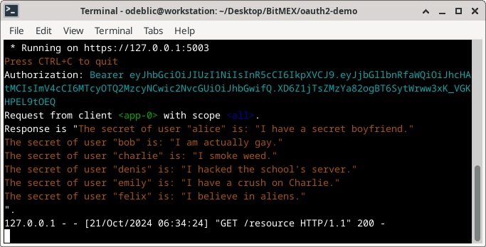

# OAuth 2.0 implementation example

## Introduction

The goal is to delegate the access to an application so that it can access the resource from a service provider on the behalf of the user, without using the user's credentials.

The protocol OAuth 2.0 will be illustrated by this demo.

More details about it:

[https://en.wikipedia.org/wiki/OAuth](https://en.wikipedia.org/wiki/OAuth)

Nice video explaining the concept:

[https://www.youtube.com/watch?v=ZV5yTm4pT8g](https://www.youtube.com/watch?v=ZV5yTm4pT8g)

## Disclaimer

This is a MVP (Minimum Viable Product) that is not (yet) production-ready.

The purpose here is the explain how OAuth 2.0 works, implementing its standard features.

However, it is a good base to start with.

To be iterated...

## Technical overview

_Components:_

1. A **user** with a web browser, owning a **resource**
2. An **application** acting as the client for the **resource**
3. An **oauth2** server granting access authorizations
4. A **service** provider holding the **resource**

The user is interacting with the components via a web browser.

The other components are the backend, exposing RESTful APIs and web pages.

_Workflow:_

1. The **user** connects to the **application**.
2. The **user** selects the scope of **resource** access.
3. The **application** redirects to the **oauth2** server.
4. The **user** consents (or not) the access.
5. The **oauth2** server generates a temporary authorization code.
6. The **application** gets a token from the **oauth2** server.
7. The **application** accesses the resource with the from the **service** provider.
8. The **application** shows the resource to the **user** on a page.

## Project layout

```
.
|-- application-client
|   |-- Makefile
|   |-- pom.xml
|   |-- README.md
|   `-- src
|       `-- main
|           |-- java
|           |   `-- com
|           |       `-- nalfiro
|           |           |-- Application.java
|           |           |-- Client.java
|           |           |-- Requests.java
|           |           |-- SecurityConfiguration.java
|           |           `-- Server.java
|           `-- resources
|               |-- application.properties
|               |-- static
|               |   `-- images
|               |       `-- secrets.jpg
|               `-- templates
|                   |-- index.html
|                   `-- view.html
|-- authorization-server
|   |-- authorize.go
|   |-- consent.go
|   |-- consent.html
|   |-- go.mod
|   |-- go.sum
|   |-- main.go
|   |-- Makefile
|   |-- README.md
|   `-- token.go
|-- LICENSE.txt
|-- Makefile
|-- README.md
|-- screenshots
|   |-- application-client.png
|   |-- authorization-server.png
|   |-- consent.png
|   |-- index.png
|   |-- makefile.png
|   |-- service-provider.png
|   |-- view.png
|   `-- warning.png
`-- service-provider
    |-- Makefile
    |-- README.md
    |-- server.py
    `-- tokengen.py
```

## Technical overview

## Usage

Setup the entire project first:

```sh
make setup
sudo make trust
```

Open three terminals (one for each component).

```sh
# first terminal
make run-app
```

```sh
# second terminal
make run-oauth
```

```sh
# third terminal
make run-serv
```

Open a web browser and connect to [https://localhost:5001/](https://localhost:5001/).

Enter a client ID (i.e. `app-0`) and a scope (i.e. `alice`), then follow the flow...

## Screenshots

Makefile help (console):


Application client (console):


Authorization server (console):


Service provider (console):



Certificate warning (browser):


Application home page (browser):


Authorization consent page (browser):


Application resource view page (browser):


## License

All the content of this repository is under AGPL license.

Please check carefully the terms in the `LICENSE.txt` file.

## Author

For any question, please contact the author: [Olivier de BLIC](mailto:odeblic@gmail.com).
